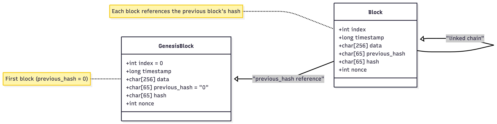

# Mini-Blockchain

This project implements a **mini blockchain engine** written in **C**, exposed through a **Flask REST API** for visualization and interaction. It was developed as a **portfolio project for Holberton School**.

---

## Objectives

- Understand and implement core blockchain concepts:
  - Block structure, SHA256 hashing, Proof-of-Work (PoW)
  - Chain validation
- Provide a simple API in Python/Flask to interact with and visualize the blockchain
- Create a clean and demonstrative web interface for portfolio purposes

---

## Key Features

### C Engine
- Block structure: `index`, `timestamp`, `data`, `previous_hash`, `hash`, `nonce`
- SHA256 hashing for each block
- Simple Proof-of-Work: hash must start with a predefined number of zeros
- Full chain validation: verify `previous_hash` and current hash integrity
- In-memory blockchain storage

### Flask API
- `GET /blocks/` → Returns the full blockchain in JSON
- `POST /blocks/add` → Adds a new block with provided data
- `GET /blocks/validate` → Checks the blockchain integrity

### Web Interface
- Displays the blockchain in real-time
- Allows mining and adding blocks directly from the UI
- Provides feedback through modals

---

## Project Structure

```text
back/
├─ blockchain/
│ ├─ code/ # C source files and compiled .so library
│ ├─ blockchain.json # Persistent blockchain ledger
└─ api/
├─ app.py # Flask API
├─ facade.py # C ↔ Python bridge
└─ routes.py # API routes
front/
├─ index.html # Homepage that displays the blockchain 
├─ mine.html # Mining page
└─ css/style.css # Styles
requirements.txt # Python dependencies
```

---

## Development Lifecycle
This project was developed in 3 weekly sprints:
* **Sprint 1:** Core C Engine & SHA256 implementation.
* **Sprint 2:** Python Bridge (ctypes) & REST API development.
* **Sprint 3:** Web Interface & Integration testing.


---


## Docker
The easiest way to run the project is using Docker, which automatically handles the C compilation and environment setup.

```Bash

docker build -t mini-blockchain . # Build the image

docker run -p 5001:5001 mini-blockchain # Run the container
```
The application will be available at http://localhost:5001


---


## Manual Installation

### 1. Prerequisites
- **OpenSSL** is required for SHA256 hashing
  - macOS: `brew install openssl`
  - Linux (Ubuntu/Debian): `sudo apt install libssl-dev`
  - Windows: [Win32/Win64 OpenSSL Installer](https://slproweb.com/products/Win32OpenSSL.html)

### 2. Python Dependencies

Create a virtual environment and install dependencies:
```bash
python3 -m venv venv # macOS/Linux
source venv/bin/activate # Windows

venv\Scripts\activate

pip install -r requirements.txt
```
### 3. Compile the C Engine

Compile the blockchain shared library:
```bash
gcc -fPIC -shared -o back/blockchain/code/blockchain.so \
    back/blockchain/code/block.c \
    back/blockchain/code/sha256.c \
    -I$(brew --prefix openssl)/include \
    -L$(brew --prefix openssl)/lib \
    -lcrypto
```
### 4. Usage

Start the Flask API server:

`python3 back/api/app.py`

Open the web interface:

http://localhost:5001/

Mine and add blocks via the web interface or API.


---


## Tests

This project includes both unit tests and integration tests to ensure the blockchain engine works correctly.

### Unit Tests
- **Genesis Block**: Verifies that the blockchain always starts with a valid genesis block (`index == 0`).
- **SHA256 & Block Hashing**: Implicitly tested when mining blocks and checking hashes for validity.
- **Data Size Checks**: Ensures the engine rejects data exceeding maximum allowed length (`DATA_SIZE`).

### Integration Tests
- **Adding Blocks via API**: Tests that the `/blocks/add` endpoint successfully mines and adds a block.
- **Blockchain Validation**: Checks that `/blocks/validate` returns success when the chain is intact.
- **Tampering Detection**: Modifies blockchain data manually and confirms that `/blocks/validate` detects corruption.
- **Recreate Blockchain with Overflow Data**: Verifies that loading a blockchain with overly long data fails gracefully.

### Running Tests
The tests are written using **pytest**:

```bash
# Activate virtual environment
source venv/bin/activate  # macOS/Linux
venv\Scripts\activate     # Windows

# Run tests
pytest test.py

All tests interact with the Flask API and the persistent blockchain JSON file to ensure both the C engine and Python API behave as expected. If you want to run the tests a second time, you must delete the blockchain.json file that was created after the first test.
```

---


## Data Schema & Persistence

Although this project uses a JSON file for persistence, the data follows a strict cryptographic structure similar to a linked list.

### Block Structure (Data Model)
The diagram below illustrates the attributes of each block and how they are linked to form the blockchain:



**Key Components of the Schema:**
* **Genesis Block:** The starting point of the chain with `index = 0` and a `previous_hash` set to "0".
* **Cryptographic Link:** Every subsequent block contains a `previous_hash` field, which is a reference to the `hash` of the block before it. This creates an immutable "linked chain".
* **Integrity Fields:** The `hash` is calculated by the C Core based on the `index`, `timestamp`, `data`, `previous_hash`, and `nonce`.
